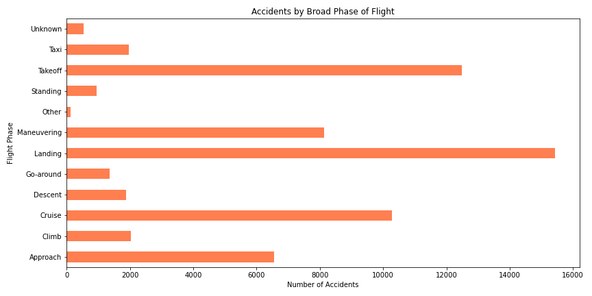
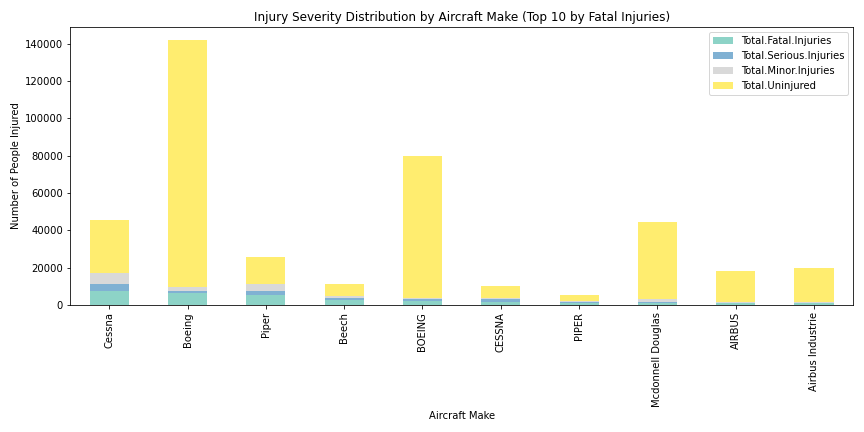
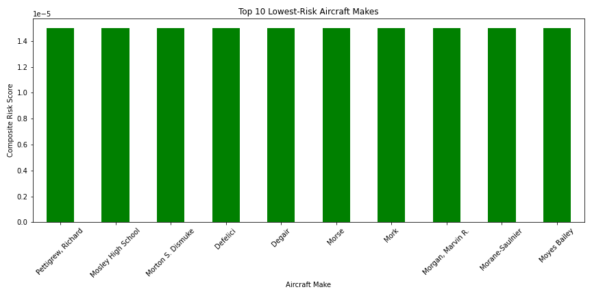

# ✈Phase 1 Project: Aviation Safety Analysis

**Student:** Patricia Louissaint  
**Cohort:** DTSC-FLEX-070824-P1

## Overview

This project analyzes aircraft accident data from 1962–2023 to assess which aircraft makes are the safest, to support strategic decisions for a company entering the aviation industry.

## Business Understanding

Our company is exploring the aviation sector and needs to evaluate the **lowest-risk aircraft** to begin building its fleet. We aim to identify patterns in accident frequency, severity, and risk levels across aircraft makes.

**Key Questions:**
- Which aircraft makes have the **highest and lowest** accident frequency?
- How does **injury severity** vary across manufacturers?
- Which aircraft makes have the **lowest composite risk score**?

## Data Understanding

- **Source:** National Transportation Safety Board (NTSB)
- **Data Range:** 1962–2023
- **Rows:** ~94,000 accident records
- **Features Used:**
  - Aircraft Make, Number of Engines, Phase of Flight, Weather, Injuries

## Data Preparation

- Filled missing values for injury counts with 0
- Removed records with no `Make` or non-standard formats
- Created `Risk Score` using weighted injuries and weather conditions
- Created `Severity_Score` for normalization

## Data Analysis & Visualizations

### 1. Top 10 Aircraft by Accident Frequency  

### 2. Injury Distribution by Make  

### 3. Top 10 Lowest-Risk Aircraft  

## Recommendations

1. **Prioritize Lower-Risk Makes:**  
   Begin fleet acquisition with aircraft makes that consistently appear at the bottom of the risk index, such as those with low accident frequency and injury severity.

2. **Avoid High-Risk Models:**  
   Deprioritize makes with high risk scores, especially those with high fatality rates and serious injuries.

3. **Inspect Single-Engine Aircraft Carefully:**  
   Single-engine planes are most common in accidents. More rigorous inspection and maintenance protocols should be adopted for these models.

---

## Conclusion

This analysis provides the foundation for safer, data-driven aircraft procurement. The composite scoring approach can be expanded to include aircraft model, operator type, and region for further accuracy.

---

## Interactive Tableau Dashboard

Explore accident trends interactively:
👉 [INSERT YOUR TABLEAU PUBLIC LINK HERE]

---

## Project Structure

