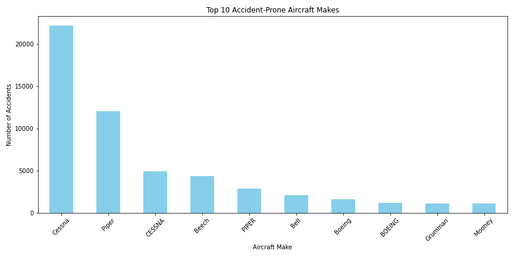

# ✈Phase 1 Project: Aviation Safety Analysis

**Student:** Patricia Louissaint  
**Cohort:** DTSC-FLEX-070824-P1

## Overview

This project analyzes aircraft accident data from 1962–2023 to assess which aircraft makes are the safest, to support strategic decisions for a company entering the aviation industry.

## Business Understanding

Our company is exploring the aviation sector and needs to evaluate the **lowest-risk aircraft** to begin building its fleet. We aim to identify patterns in accident frequency, severity, and risk levels across aircraft makes.

**Key Questions:**
- Which aircraft makes have the **highest and lowest** accident frequency?
- How does **injury severity** vary across manufacturers?
- Which aircraft makes have the **lowest composite risk score**?

## Data Understanding

- **Source:** National Transportation Safety Board (NTSB)
- **Data Range:** 1962–2023
- **Rows:** ~94,000 accident records
- **Features Used:**
  - Aircraft Make, Number of Engines, Phase of Flight, Weather, Injuries

## Data Preparation

- Filled missing values for injury counts with 0
- Removed records with no `Make` or non-standard formats
- Created `Risk Score` using weighted injuries and weather conditions
- Created `Severity_Score` for normalization

## Data Analysis & Visualizations

### 1. Top 10 Aircraft by Accident Frequency  

### 2. Injury Distribution by Make  

### 3. Top 10 Lowest-Risk Aircraft  

## Recommendations

1.	**Invest in Low-Risk Aircraft Makes:** Prioritize aircraft from the top 3–5 lowest-risk manufacturers based on composite risk scores (e.g., Cessna, Piper). These makes show strong safety   profiles across accident frequency and injury severity.

2.	**Avoid High-Risk Manufacturers:** Refrain from purchasing aircraft with consistently high fatality or severity rates, even if their total accident counts are lower.

3.	**Focus Maintenance on Single-Engine Aircraft:** Accident rates are higher among single-engine aircraft. Allocate resources to maintenance, inspection, and pilot training specifically for these models.

4.	**Conduct Further Safety Analysis:** Explore trends by flight phase and weather conditions to improve operational planning and targeted safety investments.

---

## Conclusion

These insights help the company make data-driven decisions in entering the aviation industry.

---

## Interactive Tableau Dashboard

Explore accident trends interactively:
👉 [INSERT YOUR TABLEAU PUBLIC LINK HERE]

---

## Project Structure

aviation-risk-analysis/

├──  README.md

├──  presentation.pdf

├──  final_notebook.ipynb

├──  images/

│ ├── accidents_by_make.png

│ ├── top_injury_make.png

│ └── risk_df.png

---

## 📬 Contact

Patricia Louissaint  
LinkedIn: https://www.linkedin.com/in/patricia-louissaint-831666a5/ 
